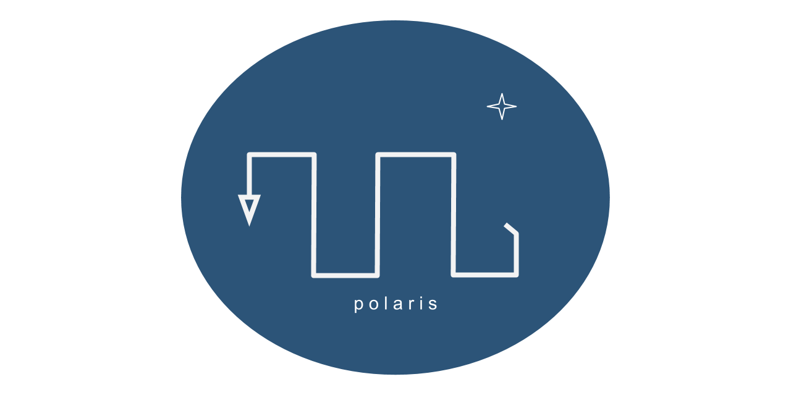

# polaris
 polaris --- PythOnLibrary for AstRodynamIcS

<p align="center">
  
</p>

polaris is a Python library for preliminary spacecraft trajectory design. 

### Dependencies
- numba
- numpy
- pandas
- scipy

Although not necessary to run polaris, the following packages are also used within the example scripts and Jupyter notebooks:
- tqdm
- plotly

### Installation
Clone this repository with
```bash
$ git clone https://github.com/Yuricst/polaris.git
```

### Usage
```python
import polaris.SolarSystemConstants as ssc
import polaris.Propagator as prop
```

For examples, go to ```./examples/``` to see Jupyter notebook tutorials. 
The full documentation is available at https://github.com/Yuricst/polaris/wiki. 
